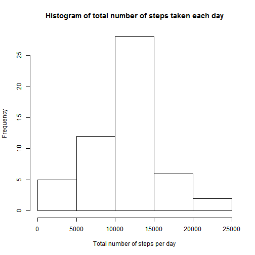
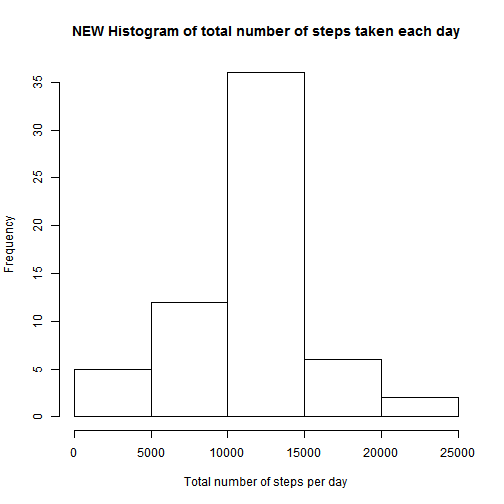

PEER ASSESSMENT 1
==================

###1. Loading and preprocessing the data
####1.1. Load the data 

Note: you must first download the necessary dataset into your working directory.


```r
unzip ("repdata-data-activity.zip")
activity <- read.csv("activity.csv")
```

###2. What is mean total number of steps taken per day?
####2.1. Calculate the total number of steps taken per day


```r
sumperday <- aggregate(steps ~ date, data=activity, sum, na.action=na.pass)
```

####2.2. Make a histogram of the total number of steps taken each day


```r
frecuency <- sumperday[,2]
hist(frecuency, main = "Histogram of total number of steps taken each day", xlab = "Total number of steps per day")
```

 

####2.3. Calculate and report the mean and median of the total number of steps taken per day


```r
meanperday <- aggregate(steps ~ date, data=activity, mean, na.action=na.pass)
medianperday <- aggregate(steps ~ date, data=activity, median, na.action=na.pass)
mmperday <- cbind(meanperday, medianperday)
mmperday <- mmperday[,-3]
colnames(mmperday) <- c("date", "meanday", "medianday")
print(mmperday)
```

```
##          date    meanday medianday
## 1  2012-10-01         NA        NA
## 2  2012-10-02  0.4375000         0
## 3  2012-10-03 39.4166667         0
## 4  2012-10-04 42.0694444         0
## 5  2012-10-05 46.1597222         0
## 6  2012-10-06 53.5416667         0
## 7  2012-10-07 38.2465278         0
## 8  2012-10-08         NA        NA
## 9  2012-10-09 44.4826389         0
## 10 2012-10-10 34.3750000         0
## 11 2012-10-11 35.7777778         0
## 12 2012-10-12 60.3541667         0
## 13 2012-10-13 43.1458333         0
## 14 2012-10-14 52.4236111         0
## 15 2012-10-15 35.2048611         0
## 16 2012-10-16 52.3750000         0
## 17 2012-10-17 46.7083333         0
## 18 2012-10-18 34.9166667         0
## 19 2012-10-19 41.0729167         0
## 20 2012-10-20 36.0937500         0
## 21 2012-10-21 30.6284722         0
## 22 2012-10-22 46.7361111         0
## 23 2012-10-23 30.9652778         0
## 24 2012-10-24 29.0104167         0
## 25 2012-10-25  8.6527778         0
## 26 2012-10-26 23.5347222         0
## 27 2012-10-27 35.1354167         0
## 28 2012-10-28 39.7847222         0
## 29 2012-10-29 17.4236111         0
## 30 2012-10-30 34.0937500         0
## 31 2012-10-31 53.5208333         0
## 32 2012-11-01         NA        NA
## 33 2012-11-02 36.8055556         0
## 34 2012-11-03 36.7048611         0
## 35 2012-11-04         NA        NA
## 36 2012-11-05 36.2465278         0
## 37 2012-11-06 28.9375000         0
## 38 2012-11-07 44.7326389         0
## 39 2012-11-08 11.1770833         0
## 40 2012-11-09         NA        NA
## 41 2012-11-10         NA        NA
## 42 2012-11-11 43.7777778         0
## 43 2012-11-12 37.3784722         0
## 44 2012-11-13 25.4722222         0
## 45 2012-11-14         NA        NA
## 46 2012-11-15  0.1423611         0
## 47 2012-11-16 18.8923611         0
## 48 2012-11-17 49.7881944         0
## 49 2012-11-18 52.4652778         0
## 50 2012-11-19 30.6979167         0
## 51 2012-11-20 15.5277778         0
## 52 2012-11-21 44.3993056         0
## 53 2012-11-22 70.9270833         0
## 54 2012-11-23 73.5902778         0
## 55 2012-11-24 50.2708333         0
## 56 2012-11-25 41.0902778         0
## 57 2012-11-26 38.7569444         0
## 58 2012-11-27 47.3819444         0
## 59 2012-11-28 35.3576389         0
## 60 2012-11-29 24.4687500         0
## 61 2012-11-30         NA        NA
```

###3. What is the average daily activity pattern?

####3.1. Make a time series plot (i.e. type = "l") of the 5-minute interval (x-axis) and the average number of steps taken, averaged across all days (y-axis)


```r
meanperinterval <- aggregate(steps ~ interval, data=activity, mean)
plot(meanperinterval, type="l", main="Average number of steps taken in each interval")
```

 

####3.2. Which 5-minute interval, on average across all the days in the dataset, contains the maximum number of steps?


```r
meanperinterval$interval[which(meanperinterval$steps==max(meanperinterval$steps))]
```

```
## [1] 835
```

###4. Imputing missing values

Note that there are a number of days/intervals where there are missing values (coded as NA). The presence of missing days may introduce bias into some calculations or summaries of the data.

####4.1. Calculate and report the total number of missing values in the dataset (i.e. the total number of rows with NAs)


```r
sum(is.na(activity))
```

```
## [1] 2304
```

####4.2. Devise a strategy for filling in all of the missing values in the dataset.

In each row where there is a missing value, I am going to introduce the average number of steps taken in that 5-minute interval, averaged across all days.

####4.3. Create a new dataset that is equal to the original dataset but with the missing data filled in.


```r
newdata <- activity
newdata[is.na(newdata)] <- meanperinterval$steps[meanperinterval$interval==newdata[which(is.na(newdata)),3]]
newdata[is.na(newdata)] <- meanperinterval$steps[meanperinterval$interval==newdata[which(is.na(newdata)),3]]
newdata[is.na(newdata)] <- meanperinterval$steps[meanperinterval$interval==newdata[which(is.na(newdata)),3]]
newdata[is.na(newdata)] <- meanperinterval$steps[meanperinterval$interval==newdata[which(is.na(newdata)),3]]
newdata[is.na(newdata)] <- meanperinterval$steps[meanperinterval$interval==newdata[which(is.na(newdata)),3]]
newdata[is.na(newdata)] <- meanperinterval$steps[meanperinterval$interval==newdata[which(is.na(newdata)),3]]
newdata[is.na(newdata)] <- meanperinterval$steps[meanperinterval$interval==newdata[which(is.na(newdata)),3]]
newdata[is.na(newdata)] <- meanperinterval$steps[meanperinterval$interval==newdata[which(is.na(newdata)),3]]
```

####4.4. Make a histogram of the total number of steps taken each day and Calculate and report the mean and median total number of steps taken per day. Do these values differ from the estimates from the first part of the assignment? What is the impact of imputing missing data on the estimates of the total daily number of steps?

The new values differ from the first ones in that the NA values now have a new value (always the same for each day that had NA value before). But the Histogram is very similar to the first one. So there is no significant change.


```r
newsumperday <- aggregate(steps ~ date, data=newdata, sum)

newfrecuency <- newsumperday[,2]
hist(newfrecuency, main = "NEW Histogram of total number of steps taken each day", xlab = "Total number of steps per day")
```

 

```r
newmeanperday <- aggregate(steps ~ date, data=newdata, mean)
newmedianperday <- aggregate(steps ~ date, data=newdata, median)
newmmperday <- cbind(newmeanperday, newmedianperday)
newmmperday <- newmmperday[,-3]
newmmperday <- newmmperday[,-1]
colnames(newmmperday) <- c("newmeanday", "newmedianday")
cbind(mmperday, newmmperday)
```

```
##          date    meanday medianday newmeanday newmedianday
## 1  2012-10-01         NA        NA 37.3825996     34.11321
## 2  2012-10-02  0.4375000         0  0.4375000      0.00000
## 3  2012-10-03 39.4166667         0 39.4166667      0.00000
## 4  2012-10-04 42.0694444         0 42.0694444      0.00000
## 5  2012-10-05 46.1597222         0 46.1597222      0.00000
## 6  2012-10-06 53.5416667         0 53.5416667      0.00000
## 7  2012-10-07 38.2465278         0 38.2465278      0.00000
## 8  2012-10-08         NA        NA 37.3825996     34.11321
## 9  2012-10-09 44.4826389         0 44.4826389      0.00000
## 10 2012-10-10 34.3750000         0 34.3750000      0.00000
## 11 2012-10-11 35.7777778         0 35.7777778      0.00000
## 12 2012-10-12 60.3541667         0 60.3541667      0.00000
## 13 2012-10-13 43.1458333         0 43.1458333      0.00000
## 14 2012-10-14 52.4236111         0 52.4236111      0.00000
## 15 2012-10-15 35.2048611         0 35.2048611      0.00000
## 16 2012-10-16 52.3750000         0 52.3750000      0.00000
## 17 2012-10-17 46.7083333         0 46.7083333      0.00000
## 18 2012-10-18 34.9166667         0 34.9166667      0.00000
## 19 2012-10-19 41.0729167         0 41.0729167      0.00000
## 20 2012-10-20 36.0937500         0 36.0937500      0.00000
## 21 2012-10-21 30.6284722         0 30.6284722      0.00000
## 22 2012-10-22 46.7361111         0 46.7361111      0.00000
## 23 2012-10-23 30.9652778         0 30.9652778      0.00000
## 24 2012-10-24 29.0104167         0 29.0104167      0.00000
## 25 2012-10-25  8.6527778         0  8.6527778      0.00000
## 26 2012-10-26 23.5347222         0 23.5347222      0.00000
## 27 2012-10-27 35.1354167         0 35.1354167      0.00000
## 28 2012-10-28 39.7847222         0 39.7847222      0.00000
## 29 2012-10-29 17.4236111         0 17.4236111      0.00000
## 30 2012-10-30 34.0937500         0 34.0937500      0.00000
## 31 2012-10-31 53.5208333         0 53.5208333      0.00000
## 32 2012-11-01         NA        NA 37.3825996     34.11321
## 33 2012-11-02 36.8055556         0 36.8055556      0.00000
## 34 2012-11-03 36.7048611         0 36.7048611      0.00000
## 35 2012-11-04         NA        NA 37.3825996     34.11321
## 36 2012-11-05 36.2465278         0 36.2465278      0.00000
## 37 2012-11-06 28.9375000         0 28.9375000      0.00000
## 38 2012-11-07 44.7326389         0 44.7326389      0.00000
## 39 2012-11-08 11.1770833         0 11.1770833      0.00000
## 40 2012-11-09         NA        NA 37.3825996     34.11321
## 41 2012-11-10         NA        NA 37.3825996     34.11321
## 42 2012-11-11 43.7777778         0 43.7777778      0.00000
## 43 2012-11-12 37.3784722         0 37.3784722      0.00000
## 44 2012-11-13 25.4722222         0 25.4722222      0.00000
## 45 2012-11-14         NA        NA 37.3825996     34.11321
## 46 2012-11-15  0.1423611         0  0.1423611      0.00000
## 47 2012-11-16 18.8923611         0 18.8923611      0.00000
## 48 2012-11-17 49.7881944         0 49.7881944      0.00000
## 49 2012-11-18 52.4652778         0 52.4652778      0.00000
## 50 2012-11-19 30.6979167         0 30.6979167      0.00000
## 51 2012-11-20 15.5277778         0 15.5277778      0.00000
## 52 2012-11-21 44.3993056         0 44.3993056      0.00000
## 53 2012-11-22 70.9270833         0 70.9270833      0.00000
## 54 2012-11-23 73.5902778         0 73.5902778      0.00000
## 55 2012-11-24 50.2708333         0 50.2708333      0.00000
## 56 2012-11-25 41.0902778         0 41.0902778      0.00000
## 57 2012-11-26 38.7569444         0 38.7569444      0.00000
## 58 2012-11-27 47.3819444         0 47.3819444      0.00000
## 59 2012-11-28 35.3576389         0 35.3576389      0.00000
## 60 2012-11-29 24.4687500         0 24.4687500      0.00000
## 61 2012-11-30         NA        NA 37.3825996     34.11321
```


