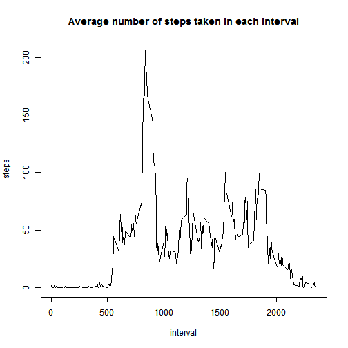

PEER ASSESSMENT 1
==================

###1. Loading and preprocessing the data
####1.1. Load the data 

Note: you must first download the necessary dataset into your working directory.


```r
unzip ("repdata-data-activity.zip")
activity <- read.csv("activity.csv")
```

###2. What is mean total number of steps taken per day?
####2.1. Calculate the total number of steps taken per day


```r
sumperday <- aggregate(steps ~ date, data=activity, sum, na.action=na.pass)
print(sumperday)
```

```
##          date steps
## 1  2012-10-01    NA
## 2  2012-10-02   126
## 3  2012-10-03 11352
## 4  2012-10-04 12116
## 5  2012-10-05 13294
## 6  2012-10-06 15420
## 7  2012-10-07 11015
## 8  2012-10-08    NA
## 9  2012-10-09 12811
## 10 2012-10-10  9900
## 11 2012-10-11 10304
## 12 2012-10-12 17382
## 13 2012-10-13 12426
## 14 2012-10-14 15098
## 15 2012-10-15 10139
## 16 2012-10-16 15084
## 17 2012-10-17 13452
## 18 2012-10-18 10056
## 19 2012-10-19 11829
## 20 2012-10-20 10395
## 21 2012-10-21  8821
## 22 2012-10-22 13460
## 23 2012-10-23  8918
## 24 2012-10-24  8355
## 25 2012-10-25  2492
## 26 2012-10-26  6778
## 27 2012-10-27 10119
## 28 2012-10-28 11458
## 29 2012-10-29  5018
## 30 2012-10-30  9819
## 31 2012-10-31 15414
## 32 2012-11-01    NA
## 33 2012-11-02 10600
## 34 2012-11-03 10571
## 35 2012-11-04    NA
## 36 2012-11-05 10439
## 37 2012-11-06  8334
## 38 2012-11-07 12883
## 39 2012-11-08  3219
## 40 2012-11-09    NA
## 41 2012-11-10    NA
## 42 2012-11-11 12608
## 43 2012-11-12 10765
## 44 2012-11-13  7336
## 45 2012-11-14    NA
## 46 2012-11-15    41
## 47 2012-11-16  5441
## 48 2012-11-17 14339
## 49 2012-11-18 15110
## 50 2012-11-19  8841
## 51 2012-11-20  4472
## 52 2012-11-21 12787
## 53 2012-11-22 20427
## 54 2012-11-23 21194
## 55 2012-11-24 14478
## 56 2012-11-25 11834
## 57 2012-11-26 11162
## 58 2012-11-27 13646
## 59 2012-11-28 10183
## 60 2012-11-29  7047
## 61 2012-11-30    NA
```

####2.2. Make a histogram of the total number of steps taken each day


```r
frecuency <- sumperday[,2]
hist(frecuency, main = "Histogram of total number of steps taken each day", xlab = "Total number of steps per day")
```

 

####2.3. Calculate and report the mean and median of the total number of steps taken per day


```r
meanperday <- mean(sumperday[,2], na.rm=TRUE)
medianperday <- median(sumperday[,2], na.rm=TRUE)
```

The mean of the total number of steps taken per day is 1.0766189 &times; 10<sup>4</sup>.
The median of the total number of steps taken per day ir 10765.

###3. What is the average daily activity pattern?

####3.1. Make a time series plot (i.e. type = "l") of the 5-minute interval (x-axis) and the average number of steps taken, averaged across all days (y-axis)


```r
meanperinterval <- aggregate(steps ~ interval, data=activity, mean)
plot(meanperinterval, type="l", main="Average number of steps taken in each interval")
```

 

####3.2. Which 5-minute interval, on average across all the days in the dataset, contains the maximum number of steps?


```r
maxinterval <- meanperinterval$interval[which(meanperinterval$steps==max(meanperinterval$steps))]
```

The interval 835 contains the maximum number of steps on average.

###4. Imputing missing values

Note that there are a number of days/intervals where there are missing values (coded as NA). The presence of missing days may introduce bias into some calculations or summaries of the data.

####4.1. Calculate and report the total number of missing values in the dataset (i.e. the total number of rows with NAs)


```r
numberofna <- sum(is.na(activity))
```

There are 2304 NA values in the dataset.

####4.2. Devise a strategy for filling in all of the missing values in the dataset.

In each row where there is a missing value, I am going to introduce the average number of steps taken in that 5-minute interval, averaged across all days.

####4.3. Create a new dataset that is equal to the original dataset but with the missing data filled in.


```r
newdata <- activity
newdata[is.na(newdata)] <- meanperinterval$steps[meanperinterval$interval==newdata[which(is.na(newdata)),3]]
newdata[is.na(newdata)] <- meanperinterval$steps[meanperinterval$interval==newdata[which(is.na(newdata)),3]]
newdata[is.na(newdata)] <- meanperinterval$steps[meanperinterval$interval==newdata[which(is.na(newdata)),3]]
newdata[is.na(newdata)] <- meanperinterval$steps[meanperinterval$interval==newdata[which(is.na(newdata)),3]]
newdata[is.na(newdata)] <- meanperinterval$steps[meanperinterval$interval==newdata[which(is.na(newdata)),3]]
newdata[is.na(newdata)] <- meanperinterval$steps[meanperinterval$interval==newdata[which(is.na(newdata)),3]]
newdata[is.na(newdata)] <- meanperinterval$steps[meanperinterval$interval==newdata[which(is.na(newdata)),3]]
newdata[is.na(newdata)] <- meanperinterval$steps[meanperinterval$interval==newdata[which(is.na(newdata)),3]]
```

####4.4. Make a histogram of the total number of steps taken each day and Calculate and report the mean and median total number of steps taken per day. Do these values differ from the estimates from the first part of the assignment? What is the impact of imputing missing data on the estimates of the total daily number of steps?

The new values differ from the first ones in that the NA values now have a new value (always the same for each day that had NA value before). But the Histogram is very similar to the first one. So there is no significant change.


```r
newsumperday <- aggregate(steps ~ date, data=newdata, sum)

newfrecuency <- newsumperday[,2]
hist(newfrecuency, main = "NEW Histogram of total number of steps taken each day", xlab = "Total number of steps per day")
```

 

```r
newmeanperday <- mean(newsumperday[,2])
newmedianperday <- median(newsumperday[,2])

old.values <- c(meanperday, medianperday)
new.values <- c(newmeanperday, newmedianperday)
data.frame(old.values, new.values, row.names=c("mean", "median"))
```

```
##        old.values new.values
## mean     10766.19   10766.19
## median   10765.00   10766.19
```

In the table above we can see that the median value has changed. As we used the mean value for each interval to fill in the NA values, in the new histogram we can see that there is more frequency on the most frequent number of steps (the highest bar in the first histogram, is even higher in the new histogram).

###5. Are there differences in activity patterns between weekdays and weekends?

####5.1. Create a new factor variable in the dataset with two levels - "weekday" and "weekend" indicating whether a given date is a weekday or weekend day.


```r
newdata$date <- strptime(newdata$date, "%Y-%m-%d")
newdata$day <- match(weekdays(newdata$date),c("lunes","martes","miércoles","jueves","viernes","sábado","domingo"))
newdata$day <- gsub(1, "weekday", newdata$day)
newdata$day <- gsub(2, "weekday", newdata$day)
newdata$day <- gsub(3, "weekday", newdata$day)
newdata$day <- gsub(4, "weekday", newdata$day)
newdata$day <- gsub(5, "weekday", newdata$day)
newdata$day <- gsub(6, "weekend", newdata$day)
newdata$day <- gsub(7, "weekend", newdata$day)
newdata <- transform(newdata, day = as.factor(day))
```

####5.2. Make a panel plot containing a time series plot (i.e. type = "l") of the 5-minute interval (x-axis) and the average number of steps taken, averaged across all weekday days or weekend days (y-axis).


```r
newmeanperinterval <- aggregate(newdata$steps, list(newdata$interval, newdata$day), data=newdata, mean)
colnames(newmeanperinterval) <- c("interval", "day", "steps")

library("lattice")

xyplot(steps ~ interval | day, newmeanperinterval, layout=c(1,2), type="l", main="Average number of steps taken in each interval: weekend vs. weekday")
```

 
